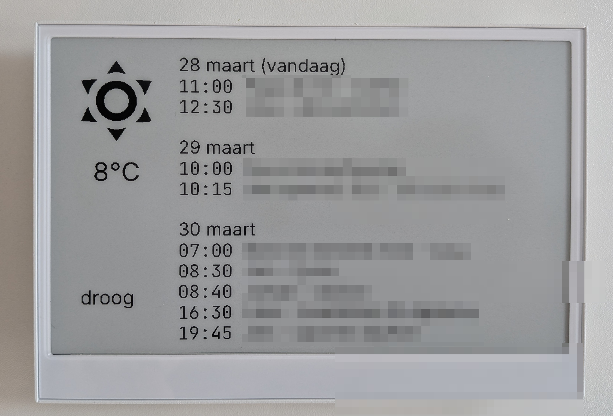

# What is this?
This is an ESPHome configuration for an reTerminal e1001 (ESP32-S3 based e-paper) dashboard. It integrates with Home Assistant to display relevant daily information on a 7.5" Waveshare e-paper screen.




# What do you need?
- a reTermminal e1001
- a working home-assistant in your home

# How does it work?
The reTerminal will connect to your wifi and home


# What to do?

## on the Reterminal
### Add secrets.yaml
- rename secrets.example.yaml to secrets.yaml
- fill in wifi_ssid and wifi_password.

### setup python venv
Make sure you have python 3 installed. At this moment I have python 3.9.6.
```bash
source .venv/bin/activate
```

### Flash 
Connect your reTerminal with a usb cable. Replace /dev/tty.usbserial-10 with your serial port. 
```bash
esphome run reterminal.yaml --device /dev/tty.usbserial-10
```

## on Home Assistant
Look in the folder /home-assistant for an example. 

The reterminal will need reterminal_neerslag and reterminal_agenda from home assistant.


# ! Warning Vibe coded !
This fuzzy .yml files are vibe coded. But I made it work. 
So take the best out of it and make it work.